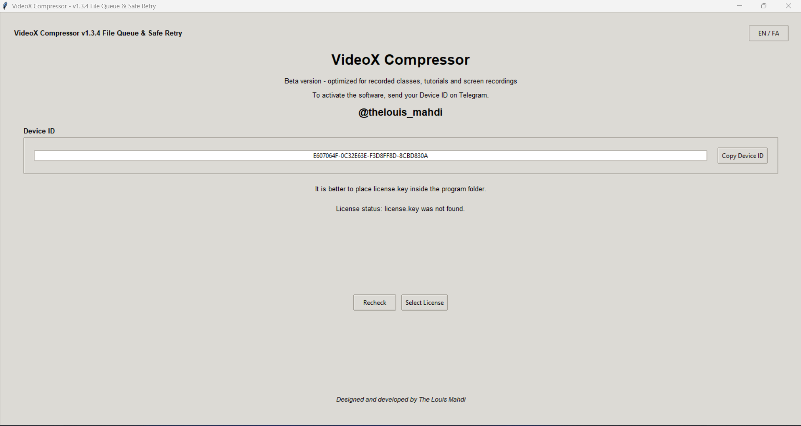
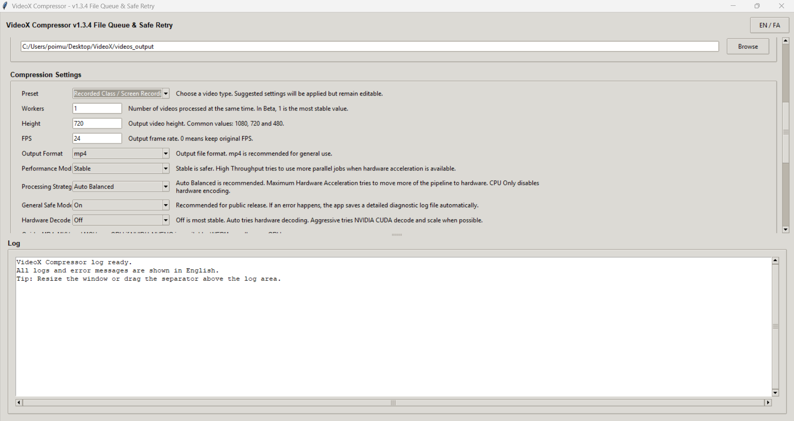
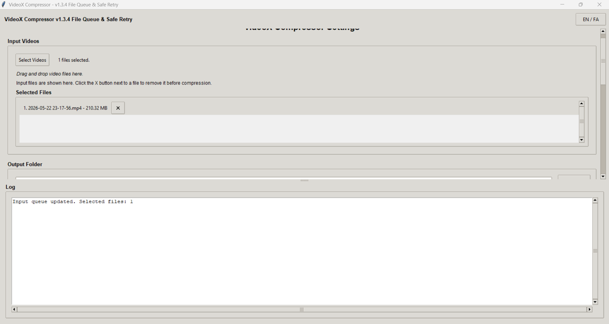
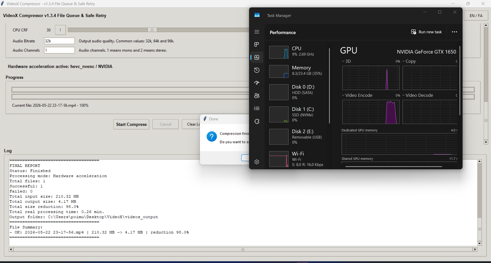

<div align="center">

# 🎬 VideoX Compressor

### Simple, hardware-accelerated Windows video compression for recorded classes, tutorials, screen recordings and low-motion videos.

<p>
  <a href="#download-en">Download</a> •
  <a href="#english">English</a> •
  <a href="#quick-start-en">Quick Start</a> •
  <a href="#activation-en">Activation</a> •
  <a href="#settings-en">Settings</a> •
  <a href="#pipeline-en">Pipeline</a> •
  <a href="#persian">فارسی</a>
</p>


**Code, design and development by The Louis Mahdi**  
**Telegram:** `@thelouis_mahdi`

</div>

---

<a id="download-en"></a>

## Download for Windows

For normal users, download the ready-to-run Windows ZIP package from **Releases**. You do **not** need to clone the source code.

<div align="center">

### 👉 [Download latest Windows release](https://github.com/TheLouisMahdi/VideoX_Compressor/releases/latest)

</div>

Recommended package name:

```text
VideoX_Compressor_v1.4.4_Beta_Stable_Device_ID.zip
```

After downloading:

1. Extract the ZIP file.
2. Run `VideoX.exe`.
3. Copy your Device ID from the activation page.
4. Send it to `@thelouis_mahdi` on Telegram to receive your device-specific `license.key` file.

> VideoX uses device-specific activation. Do not publish your `license.key` file.

---

<a id="english"></a>

# 🇬🇧 English

## What is VideoX Compressor?

**VideoX Compressor** is a Windows GUI video compression tool designed to reduce large video files with a simple workflow.

It is best optimized for:

- recorded classes
- tutorials
- screen recordings
- online meetings
- slide-based educational videos
- low-motion lecture videos
- already-compressed videos that need smaller output size

Depending on the system, VideoX can try **NVIDIA NVENC**, **Intel QSV / Quick Sync**, **AMD AMF**, or fall back to CPU mode. It uses FFmpeg and FFprobe internally.

> Current public beta: **VideoX Compressor v1.4.4 Beta - Stable Device ID**

---

<a id="quick-start-en"></a>

## Quick Start for Normal Users

For most users, use **Simple Mode**.

Recommended simple setup:

```text
Interface Mode: Simple
Compression Level: Medium or Compressed
Fast Mode: On for GPU / parallel processing
Fast Mode: Off for CPU-only compression
```

Then:

1. Select videos.
2. Check the selected file queue.
3. Remove unwanted files using the `X` button.
4. Choose the output folder.
5. Click **Start Compress**.
6. Check the final report after compression.

VideoX avoids upscaling smaller videos, especially in Simple Mode. For example, a 480p source will not be enlarged to 720p only because a preset requested 720p.

---

<a id="activation-en"></a>

## License Activation Guide

VideoX uses a **Device ID based license system**.

1. Run `VideoX.exe`.
2. Copy the Device ID from the activation page.
3. Send your Device ID on Telegram to:

```text
@thelouis_mahdi
```

4. After verification, you will receive a device-specific `license.key` file.
5. Place `license.key` next to `VideoX.exe`, or select it from inside the app.
6. Click **Recheck**.
7. Enter the program.

### Stable Device ID in v1.4.4

Version `v1.4.4` improves Device ID stability.

Previous beta builds could generate a different Device ID when system network information changed, because the old algorithm depended on values such as computer name and MAC address. This could happen after changes involving Wi-Fi, LAN, Bluetooth, VPN, virtual adapters, Hyper-V, WSL or random MAC address settings.

The new Device ID logic:

- removes MAC address dependency
- removes computer-name dependency
- uses Windows MachineGuid as the primary stable identity
- creates a persistent Install ID fallback if MachineGuid is not available
- is not affected by GPU, driver, VPN, Wi-Fi, Bluetooth or network adapter changes

Important: users of older beta builds may need a new `license.key` once after upgrading, because the more stable Device ID algorithm can generate a new ID the first time.

---

## Simple Mode vs Advanced Mode

VideoX has two interface modes.

| Mode | Purpose |
|---|---|
| Simple | For normal users. Choose only one compression level and optionally enable Fast Mode. |
| Advanced | Full control over GPU, CPU, FPS, height, audio, pipeline and diagnostics. |

Simple Mode levels:

| Level | Target |
|---|---|
| High Quality | Best simple choice when quality matters more than minimum size. |
| Medium | Balanced size and quality. |
| Compressed | Smaller output for classes and tutorials. |
| Very Compressed | Stronger compression for low-motion videos. |
| Very Very Compressed | Aggressive compression with possible visible quality loss. |
| Maximum Compression | Smallest-size simple mode; quality loss may happen. |

Simple Mode FPS behavior:

| Level | FPS |
|---|---|
| High Quality | 30 |
| Medium | 30 |
| Compressed | 25 |
| Very Compressed | 25 |
| Very Very Compressed | 24 |
| Maximum Compression | 24 |

Simple Mode Fast Mode:

| Fast Mode | Behavior |
|---|---|
| On | Prefers GPU / hardware encoding and may use faster parallel processing. |
| Off | Uses CPU-only compression for safer compatibility. |

---

## Why VideoX?

| Feature | Explanation |
|---|---|
| Simple / Advanced UI | Simple Mode for normal users; Advanced Mode for full control. |
| Stable Device ID | More stable activation ID in v1.4.4. |
| Hardware acceleration | Tries NVIDIA, Intel or AMD hardware encoding when available. |
| Dynamic GPU Preference | Shows only hardware paths that pass real runtime tests. |
| Pipeline preview | Explains the real Decode / Scale / Encode path before compression. |
| Legacy NVIDIA fallback | Can use a legacy NVIDIA FFmpeg build for older NVIDIA driver compatibility. |
| CPU fallback | Uses CPU mode when hardware acceleration is unavailable or unstable. |
| Smart Size Target | Improves size reduction on already-compressed videos. |
| No upscale protection | Prevents smaller sources from being enlarged unnecessarily. |
| File queue | Shows selected input files before compression. |
| Output validation | Checks output files and deletes invalid/corrupted partial outputs. |
| Diagnostic reports | Saves useful logs for debugging hardware and FFmpeg issues. |

---

<a id="screenshots-en"></a>

## Screenshots

### License / Device ID Activation

<div align="center">



</div>

### Main Compression Settings

<div align="center">



</div>

### File Queue and Removable Input List

<div align="center">



</div>

### Progress and Final Report

<div align="center">



</div>

---

<a id="settings-en"></a>

## Recommended Settings

### Simple Mode, normal use

```text
Interface Mode: Simple
Compression Level: Medium or Compressed
Fast Mode: On
```

### Simple Mode, CPU-only compatibility

```text
Interface Mode: Simple
Compression Level: Medium or Compressed
Fast Mode: Off
```

### Advanced Mode, safe public setting

```text
Preset: Recorded Class / Screen Recording
Output Format: mp4
Performance Mode: Stable
Processing Strategy: Auto Balanced
General Safe Mode: On
Hardware Decode: Off
Workers: 1
GPU Preference: Auto Best Available
GPU Quality: 32 to 36
CPU CRF: 30 to 34
```

### Already-compressed videos

```text
Height: keep original height
FPS: 0 or Simple Mode default
GPU Preference: Auto Best Available
GPU Quality: 35 to 40
CPU CRF: 34 to 38
Audio Bitrate: 32k
Audio Channels: 1
Performance Mode: Stable
Processing Strategy: Auto Balanced
Hardware Decode: Off
```

---

<a id="pipeline-en"></a>

## Pipeline Clarity Guide

VideoX explains the real processing path so users can understand what is running on CPU and what is running on GPU.

### Performance Mode

| Option | What it does |
|---|---|
| Stable | Safer mode. Usually processes one hardware job at a time. |
| High Throughput | May process up to 2 hardware jobs in parallel on supported hardware. |

High Throughput does not directly improve quality and may not make one single file faster.

### Processing Strategy

| Option | What it means |
|---|---|
| Auto Balanced | Recommended default. Uses hardware encoding when available while keeping safer behavior. |
| Maximum Hardware Acceleration | Most meaningful for NVIDIA with Hardware Decode set to Aggressive. |
| CPU Only | Disables GPU encoding and forces CPU encoding. |

### Hardware Decode

| Option | Decode | Scale | Encode |
|---|---|---|---|
| Off | CPU | CPU | GPU or CPU depending on selected encoder |
| Auto | FFmpeg hardware auto when possible | Usually CPU | GPU or CPU |
| Aggressive | Mainly NVIDIA CUDA when NVIDIA is selected | NVIDIA CUDA only in NVIDIA + Maximum mode | NVIDIA NVENC |

`Hardware Decode: Off` is the safest mode and still allows GPU encoding.

### GPU Preference

VideoX shows only hardware options that pass real runtime tests.

Possible options:

```text
Auto Best Available
NVIDIA NVENC
Intel QSV
AMD AMF
CPU Only
```

For dual-GPU laptops, set these files to **High Performance** in Windows Graphics Settings:

```text
VideoX.exe
ffmpeg/modern/bin/ffmpeg.exe
ffmpeg/legacy-nvidia/bin/ffmpeg.exe
```

NVIDIA Control Panel alone may not always be enough because the actual encoding process is performed by `ffmpeg.exe`.

---

## Quality Controls

### GPU Quality

| Range | Meaning |
|---|---|
| 18 to 25 | Very high quality, larger file |
| 26 to 32 | Balanced quality and size |
| 33 to 36 | Smaller file, good for classes and low-motion videos |
| 37 to 45 | Strong compression, higher quality-loss risk |

### CPU CRF

| Range | Meaning |
|---|---|
| 18 to 24 | High quality, larger file |
| 25 to 30 | Balanced mode |
| 31 to 34 | Smaller file, good for classes and tutorials |
| 35 to 45 | Strong compression, higher quality-loss risk |

---

## Diagnostic Logs and Bug Reports

If an error happens, VideoX can save diagnostic information that helps identify the problem.

Reports may include:

- app version
- local and UTC timestamp
- Windows and system information
- modern FFmpeg path
- legacy NVIDIA FFmpeg path
- available encoders
- runtime encoder test results
- NVIDIA driver information
- selected GPU Preference
- selected encoder
- FFmpeg profile used
- pipeline preview
- current input file
- FFmpeg error output
- UI log

Default log folder:

```text
C:\Users\<User>\AppData\Local\TheLouisMahdi\VideoXCompressor\logs
```

Use **Open Logs** or **Export Bug Report** when reporting a problem.

---

## Required Package Structure

```text
VideoX_Compressor_v1.4.4_Beta_Stable_Device_ID/
├── VideoX.exe
├── ffmpeg/
│   ├── modern/
│   │   └── bin/
│   │       ├── ffmpeg.exe
│   │       └── ffprobe.exe
│   └── legacy-nvidia/
│       └── bin/
│           ├── ffmpeg.exe
│           └── ffprobe.exe
├── _internal/
├── README.txt
└── LICENSE_NOTICE.txt
```

Do not delete:

```text
ffmpeg/
_internal/
```

Do not include `license.key` in the public ZIP package.

---

## Beta Status

VideoX Compressor is currently in **Beta**. It is usable and actively tested, but it is still being improved toward a more polished commercial-level release.

Current focus:

- better results on recorded classes and low-motion videos
- better behavior for already-compressed videos
- stable Device ID and activation workflow
- better compatibility with Intel, NVIDIA and AMD systems
- clearer UI for non-technical users
- safer retry and fallback behavior
- continuous feedback from testers and real users

---

<a id="persian"></a>

<div dir="rtl" align="right">

# 🇮🇷 فارسی

## معرفی برنامه

**ویدیو ایکس کامپرسور** یک نرم‌افزار ویندوزی برای فشرده‌سازی ویدیو است. هدف برنامه این است که کاربر بدون درگیر شدن با دستورهای پیچیده، بتواند فایل‌های ویدیویی سنگین را به خروجی کم‌حجم‌تر تبدیل کند.

تمرکز اصلی برنامه روی فشرده‌سازی شتاب‌داده‌شده با سخت‌افزار است. برنامه بسته به سخت‌افزار و درایور می‌تواند از مسیرهای انویدیا، اینتل، ای‌ام‌دی یا پردازنده استفاده کند.

> نسخه فعلی بتا: **VideoX Compressor v1.4.4 Beta - Stable Device ID**

---

## دانلود و نصب

آخرین نسخه را از بخش Releases دانلود کنید:

```text
VideoX_Compressor_v1.4.4_Beta_Stable_Device_ID.zip
```

بعد از دانلود:

1. فایل ZIP را Extract کنید.
2. فایل `VideoX.exe` را اجرا کنید.
3. کد دستگاه را از صفحه فعال‌سازی کپی کنید.
4. کد را در تلگرام به `@thelouis_mahdi` بفرستید.
5. فایل `license.key` مخصوص همان دستگاه را دریافت کنید.

---

## شروع سریع برای کاربر عادی

برای بیشتر کاربران، حالت ساده پیشنهاد می‌شود:

```text
Interface Mode: Simple
Compression Level: Medium یا Compressed
Fast Mode: On برای استفاده از GPU / پردازش سریع‌تر
Fast Mode: Off برای فشرده‌سازی فقط با CPU
```

برنامه در حالت ساده از بزرگ‌کردن بی‌دلیل ویدیوهای کوچک جلوگیری می‌کند. مثلاً اگر ویدیو 480p باشد، فقط به خاطر انتخاب یک حالت 720p، به 720p تبدیل نمی‌شود.

---

## فعال‌سازی و Stable Device ID

نسخه `v1.4.4` پایداری Device ID را بهتر می‌کند.

در نسخه‌های قبلی، Device ID ممکن بود به دلیل تغییر اطلاعات شبکه عوض شود؛ مثلاً با تغییر Wi-Fi، LAN، Bluetooth، VPN، آداپتور مجازی، Hyper-V، WSL یا Random MAC Address.

در نسخه جدید:

- وابستگی به MAC Address حذف شد.
- وابستگی به نام کامپیوتر حذف شد.
- مبنای اصلی Device ID مقدار Windows MachineGuid است.
- اگر MachineGuid در دسترس نباشد، یک Install ID پایدار ساخته و ذخیره می‌شود.
- تغییر کارت گرافیک، درایور، VPN، وای‌فای، بلوتوث یا کارت شبکه نباید Device ID را عوض کند.

نکته مهم: کاربران نسخه‌های قدیمی‌تر ممکن است بعد از ارتقا به v1.4.4 یک بار به لایسنس جدید نیاز داشته باشند، چون الگوریتم Device ID پایدارتر شده است.

---

## حالت ساده و حرفه‌ای

| حالت | کاربرد |
|---|---|
| Simple | مناسب کاربر عمومی؛ فقط سطح فشرده‌سازی و Fast Mode را انتخاب می‌کند. |
| Advanced | مناسب کاربر حرفه‌ای؛ کنترل کامل روی GPU، CPU، FPS، کیفیت، صدا و Pipeline. |

سطح‌های حالت ساده:

| سطح | کاربرد |
|---|---|
| کیفیت بالا | وقتی کیفیت مهم‌تر از کمترین حجم است. |
| متوسط | تعادل بین حجم و کیفیت. |
| فشرده | خروجی کم‌حجم‌تر برای کلاس و آموزش. |
| خیلی فشرده | فشرده‌سازی قوی‌تر برای ویدیوهای کم‌تحرک. |
| خیلی خیلی فشرده | فشرده‌سازی تهاجمی با احتمال افت کیفیت. |
| فشرده‌ترین حالت ممکن | کمترین حجم ممکن در حالت ساده؛ افت کیفیت ممکن است. |

رفتار FPS در حالت ساده:

| سطح | FPS |
|---|---|
| کیفیت بالا | 30 |
| متوسط | 30 |
| فشرده | 25 |
| خیلی فشرده | 25 |
| خیلی خیلی فشرده | 24 |
| فشرده‌ترین حالت ممکن | 24 |

---

## راهنمای Pipeline

### Performance Mode

| گزینه | اثر واقعی |
|---|---|
| Stable | امن‌تر؛ معمولاً یک پردازش سخت‌افزاری همزمان. |
| High Throughput | در صورت پشتیبانی سخت‌افزار، ممکن است تا دو پردازش همزمان انجام دهد. |

### Processing Strategy

| گزینه | اثر واقعی |
|---|---|
| Auto Balanced | حالت پیشنهادی برای بیشتر کاربران. |
| Maximum Hardware Acceleration | بیشترین اثر روی NVIDIA همراه با Hardware Decode Aggressive دارد. |
| CPU Only | پردازش گرافیکی برای Encode را غیرفعال می‌کند. |

### Hardware Decode

| گزینه | Decode | Scale | Encode |
|---|---|---|---|
| Off | CPU | CPU | GPU یا CPU بسته به Encoder انتخاب‌شده |
| Auto | تلاش خودکار FFmpeg برای Decode سخت‌افزاری | معمولاً CPU | GPU یا CPU |
| Aggressive | عمدتاً NVIDIA CUDA | فقط در NVIDIA + Maximum می‌تواند CUDA Scale شود | NVIDIA NVENC |

خاموش بودن Hardware Decode به معنی خاموش شدن GPU Encode نیست.

---

## نکته برای لپتاپ‌های دو گرافیکه

روی لپتاپ‌های دو گرافیکه، بهتر است این فایل‌ها را در Windows Graphics Settings روی High Performance قرار دهید:

```text
VideoX.exe
ffmpeg/modern/bin/ffmpeg.exe
ffmpeg/legacy-nvidia/bin/ffmpeg.exe
```

تنظیم NVIDIA Control Panel به‌تنهایی همیشه کافی نیست، چون پردازش اصلی توسط `ffmpeg.exe` انجام می‌شود.

---

## ساختار لازم پوشه‌ها

```text
VideoX_Compressor_v1.4.4_Beta_Stable_Device_ID/
├── VideoX.exe
├── ffmpeg/
│   ├── modern/
│   │   └── bin/
│   │       ├── ffmpeg.exe
│   │       └── ffprobe.exe
│   └── legacy-nvidia/
│       └── bin/
│           ├── ffmpeg.exe
│           └── ffprobe.exe
├── _internal/
├── README.txt
└── LICENSE_NOTICE.txt
```

پوشه‌های `ffmpeg` و `_internal` را حذف نکنید. فایل `license.key` را داخل بسته عمومی قرار ندهید.

</div>

---

<div align="center">

### Code, design and development by **The Louis Mahdi**

**Telegram:** `@thelouis_mahdi`

</div>
