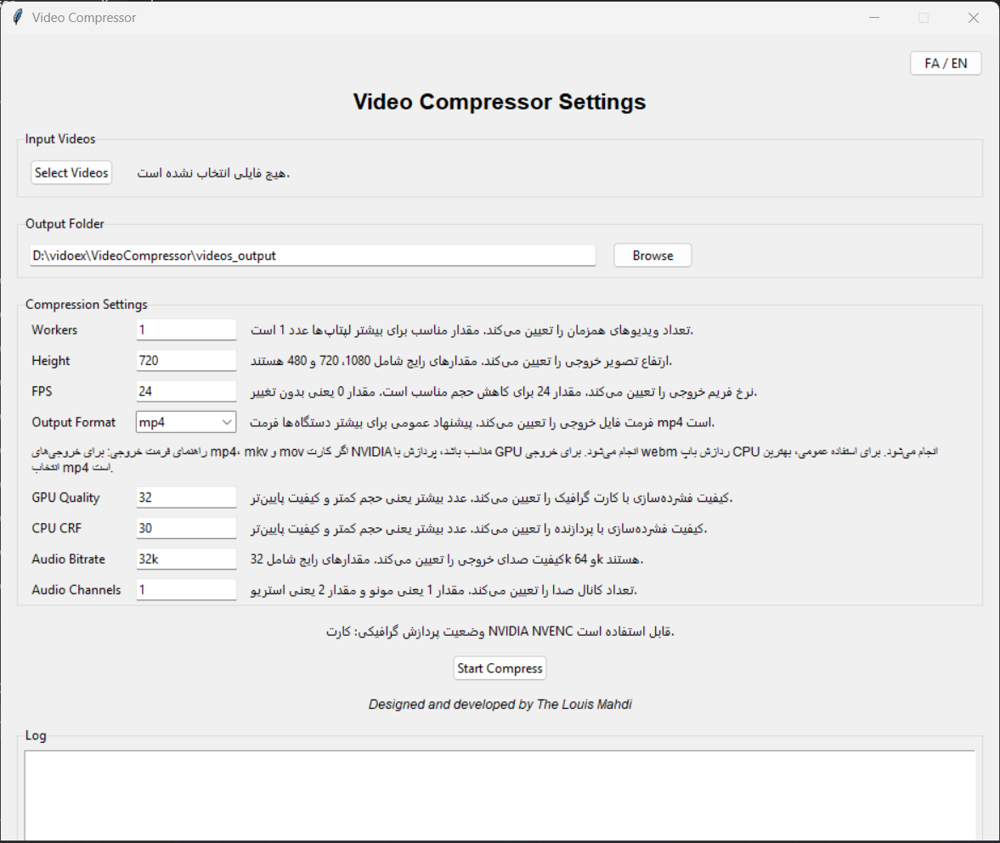
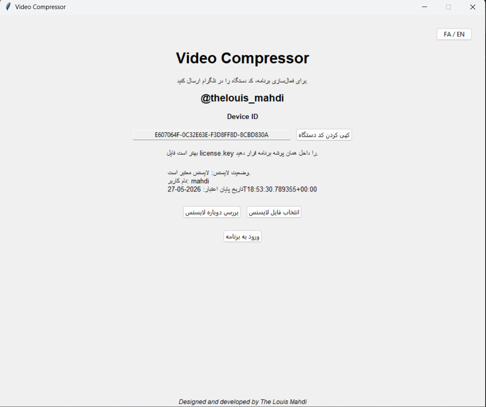

<div align="center">

# 🎬 VideoX Compressor

### GPU-accelerated Windows video compression powered by FFmpeg, NVIDIA NVENC, CPU fallback, and Device ID activation.

<p>
  <a href="#english">English</a> •
  <a href="#whats-new">What's New</a> •
  <a href="#screenshots">Screenshots</a> •
  <a href="#real-compression-example">Real Test</a> •
  <a href="#settings-guide">Settings Guide</a> •
  <a href="#parameter-ranges">Parameter Ranges</a> •
  <a href="#beta-status">Beta Status</a> •
  <a href="#activation">Activation</a> •
  <a href="#فارسی">فارسی</a>
</p>


</div>

---

<a id="english"></a>

## 🇬🇧 English

**VideoX Compressor** is a Windows video compression tool designed to reduce video file size quickly without forcing users to write FFmpeg commands manually.

The main idea behind VideoX is **hardware-accelerated compression**. When a compatible NVIDIA GPU is available, the app uses **NVIDIA NVENC** to move video encoding from the CPU to the GPU. This can make compression much faster than typical CPU-only workflows, especially on laptops and PCs with supported NVIDIA graphics cards.

VideoX is currently strongest on **recorded classes, screen recordings, tutorials, meetings, slides, and low-motion educational videos**. On this type of content, it can dramatically reduce file size while keeping the output highly usable.

---

<a id="whats-new"></a>

## 🆕 Important Changes in the Latest Beta

The latest beta focuses on stability, usability, and a more professional workflow. These are the most important changes compared with the previous beta versions:

| Area | Added / Improved |
|---|---|
| UI Stability | Resizable window, scrollable settings panel, resizable log area, mouse-wheel scrolling |
| Queue Safety | Files and settings are locked while compression is running, preventing queue corruption |
| Hidden FFmpeg Window | FFmpeg / FFprobe now run without opening a visible CMD window |
| Progress Tracking | Current-file progress bar, total progress bar, and controlled progress logs |
| Better Reports | English final report with input size, output size, reduction percentage, success/fail count and output path |
| Better Errors | Clearer English FFmpeg error messages with possible fixes |
| Presets | Ready-made profiles for different video types while keeping settings editable |
| Save Settings | Language, preset, output folder, window size and custom settings are saved |
| Cancel Support | Compression can be stopped from inside the UI |
| ffprobe Metadata | Reads source FPS, resolution, codec and duration for better warnings and reporting |
| Disk Check | Warns if the selected output drive may not have enough free space |
| Log Tools | Save Log, Clear Log and automatic log saving |

---

## ✨ Key Features

| Feature | Description |
|---|---|
| GPU Acceleration | Uses NVIDIA NVENC hardware encoding when available |
| CPU Fallback | Works with CPU mode when a compatible NVIDIA GPU is not available |
| FFmpeg Engine | Uses FFmpeg under the hood for reliable compression |
| Simple Windows GUI | Designed for normal users, not only technical users |
| Persian / English UI | Bilingual interface with built-in hints |
| Ready Presets | Includes profiles for class recordings, balanced use, gaming, movies and social media |
| Editable Settings | Presets apply suggested values, but users can still edit output format and parameters |
| Multiple Formats | Supports common input files and MP4, MKV, MOV, WEBM, AVI outputs |
| Progress & Logs | Shows progress, final report and detailed English logs |
| Device ID Activation | License activation based on the registered device |
| Real Use Case | Optimized first for recorded classes and low-motion educational videos |

---

<a id="screenshots"></a>

## 📸 Application Screenshots

### Main Compression Interface

<div align="center">



</div>

The main panel lets the user select videos, choose output folder, select output format, and tune compression settings such as workers, height, FPS, GPU quality, CPU CRF, audio bitrate and audio channels.

### NVIDIA GPU Acceleration in Action

<div align="center">


</div>

In this test, VideoX used **NVIDIA GeForce GTX 1650 Ti** and pushed the GPU video encode engine close to full utilization. This shows the accelerator nature of the app: supported GPUs can process video compression much faster than CPU-only encoding.

### Device ID License Activation

<div align="center">



</div>

The activation screen displays the user Device ID. The user sends this Device ID on Telegram and receives a device-specific `license.key` file.

---

<a id="real-compression-example"></a>

## 🚀 Real Compression Example

### Recorded Class Compression Test

<div align="center">


</div>

This real test was performed on a recorded class video.

| Item | Size |
|---|---:|
| Original recorded class video | 1.96 GB |
| Compressed output | 25 MB |

```text
Approximate size reduction: ~98.7%
```

This level of compression is especially realistic for low-motion videos such as recorded classes, screen recordings, meetings, slides, tutorials and educational videos.

---

<a id="settings-guide"></a>

## 🎛️ Ready Presets & Settings Guide

VideoX includes ready-made modes for common video types. Presets apply suggested settings automatically, but the user can still edit parameters afterward.

### 1. Recorded Classes / Screen Recording / Meetings / Tutorials

Best for low-motion educational content. This is the current main optimization target.

```text
Workers: 1
Height: 720 or 1080
FPS: 24
Output Format: mp4
GPU Quality: 32
CPU CRF: 30
Audio Bitrate: 32k
Audio Channels: 1
```

### 2. Balanced

A safer general-purpose mode when you are not sure which preset to choose.

```text
Workers: 1
Height: 1080
FPS: 0
Output Format: mp4
GPU Quality: 30
CPU CRF: 28
Audio Bitrate: 64k
Audio Channels: 2
```

### 3. Gaming / High Motion / Fast Camera Movement

Use higher FPS and better quality settings. Very low FPS such as 24 may cause motion to feel less smooth on high-motion videos.

```text
Workers: 1
Height: 1080
FPS: 0 or 60
Output Format: mp4
GPU Quality: 28
CPU CRF: 25
Audio Bitrate: 64k
Audio Channels: 2
```

### 4. Movies / TV Series / Cinematic Videos

Use this mode when detail preservation matters more than extreme compression.

```text
Workers: 1
Height: 1080
FPS: 0 or 24
Output Format: mp4
GPU Quality: 27
CPU CRF: 24
Audio Bitrate: 96k
Audio Channels: 2
```

### 5. Social Media / Fast Sharing / Ultra Small Size

Use this mode when the smallest possible size is the priority.

```text
Workers: 1
Height: 480
FPS: 24
Output Format: mp4
GPU Quality: 35
CPU CRF: 33
Audio Bitrate: 24k
Audio Channels: 1
```

---

<a id="parameter-ranges"></a>

## 📏 Parameter Ranges

| Parameter | Allowed / Recommended Range | Meaning |
|---|---|---|
| Workers | 1 to 4 | Number of simultaneous compression jobs. For GPU mode, VideoX may force Workers to 1 for stability. |
| Height | 144 or higher | Output video height. Common values: 480, 720, 1080. |
| FPS | 0 or higher | `0` keeps original FPS. 24 is good for classes; 30/60 is better for high-motion videos. |
| Output Format | mp4, mkv, mov, webm, avi | MP4 is recommended for general use. |
| GPU Quality | 18 to 45 | Lower number = better quality / larger file. Higher number = smaller file / lower quality. |
| CPU CRF | 18 to 45 | Lower number = better quality / larger file. Higher number = smaller file / lower quality. |
| Audio Bitrate | Format like 24k, 32k, 64k, 96k | Higher value gives better audio quality and larger size. |
| Audio Channels | 1 or 2 | `1` = mono, `2` = stereo. |

### Quick Quality Guide

```text
GPU Quality:
26 = High Quality
28 = Balanced
30 = Compressed
32 = Heavy Compression
35 = Ultra Small Size

CPU CRF:
22-24 = High Quality
25-28 = Balanced
30+ = Heavy Compression

FPS:
0 = Keep original FPS
24 = Classes / tutorials / low-motion videos
30 = General videos
60 = Gaming / fast motion

Height:
1080 = High Quality
720 = Balanced
480 = Ultra Small Size

Audio:
32k mono = Smallest Size
64k stereo = Better Quality
96k stereo = Movies / Music
```

---

## ⚙️ GPU / CPU Behavior

| Output Format | Processing Mode |
|---|---|
| MP4 | GPU if NVIDIA NVENC is available, otherwise CPU |
| MKV | GPU if NVIDIA NVENC is available, otherwise CPU |
| MOV | GPU if NVIDIA NVENC is available, otherwise CPU |
| WEBM | CPU mode |
| AVI | GPU/CPU depending on available encoder |

For general use, **MP4** is recommended.

---

<a id="download"></a>

## 📦 Download & Installation

Go to the **Releases** section and download the latest ZIP file.

```text
VideoX_Compressor_v1.x_Beta.zip
```

Extract the ZIP file and run:

```text
VideoX.exe
```

Do not delete these folders:

```text
ffmpeg/
_internal/
```

The FFmpeg folder should contain:

```text
ffmpeg/bin/ffmpeg.exe
ffmpeg/bin/ffprobe.exe
```

---

<a id="activation"></a>

## 🔐 License Activation

After opening the software, the app shows your **Device ID**.

Send the Device ID on Telegram:

```text
@thelouis_mahdi
```

After verification, you will receive a `license.key` file.

Place `license.key` next to `VideoX.exe` or select it from inside the app.

### Activation Steps

1. Run `VideoX.exe`.
2. Copy your Device ID.
3. Send it to `@thelouis_mahdi` on Telegram.
4. Receive `license.key`.
5. Put `license.key` next to the EXE file or select it inside the app.
6. Recheck license.
7. Enter the program.

---

## 🚀 How to Use

1. Download the ZIP file from Releases.
2. Extract the ZIP file.
3. Run `VideoX.exe`.
4. Activate the software with `license.key`.
5. Select videos or drag and drop them into the app.
6. Choose output folder.
7. Choose a ready preset or edit parameters manually.
8. Select output format.
9. Click **Start Compress**.
10. Watch progress in the UI and read the final report in the log.

---

<a id="beta-status"></a>

## 🧪 Beta Status & Development Roadmap

VideoX Compressor is currently in a **beta stage**. It is not yet a fully polished commercial product, but it is being developed step by step in that direction.

The current version is already useful for its main target: **recorded classes and low-motion educational videos**. Other content types such as gaming, cinematic footage, fast camera movement and high-motion videos still need more testing and better presets.

### Current Notes

- High-motion videos may feel less smooth if compressed at low FPS.
- ETA is still approximate and does not perfectly reflect real GPU acceleration speed.
- GPU mode is fastest and most stable with `Workers: 1` in the current beta.
- Current presets are best tuned for recorded classes, tutorials and screen recordings.
- More real-world testing is ongoing with program testers and users.

### Planned Improvements

- More accurate ETA calculation with GPU-aware speed estimation.
- Better high-motion presets for gaming, cinematic footage and fast camera movement.
- Better worker management for different laptop/desktop hardware levels.
- More refined UI/UX improvements.
- More testing with real users and program testers.

As the developer, I stay in direct contact with program testers and users to collect feedback, fix bugs and improve the application over time.

---

<a id="فارسی"></a>

## 🇮🇷 فارسی

**VideoX Compressor** یک نرم‌افزار ویندوزی برای فشرده‌سازی ویدیو است که بدون نیاز به کار با دستورهای پیچیده FFmpeg، حجم فایل‌های ویدیویی را کاهش می‌دهد.

ایده اصلی VideoX استفاده از **شتاب‌دهی سخت‌افزاری GPU** است. اگر سیستم کارت گرافیک NVIDIA مناسب داشته باشد، برنامه از **NVIDIA NVENC** برای پردازش سریع‌تر استفاده می‌کند و اگر GPU مناسب موجود نباشد، به‌صورت خودکار با CPU کار می‌کند.

نقطه قوت اصلی نسخه فعلی، ویدیوهای کم‌تحرک مثل **کلاس ضبط‌شده، اسکرین‌ریکورد، آموزش، جلسه و پاورپوینت** است. روی این نوع ویدیوها، VideoX می‌تواند حجم فایل را به‌شدت کاهش دهد و خروجی همچنان قابل استفاده باقی بماند.

---

## 🆕 تغییرات مهم نسخه جدید

| بخش | تغییرات مهم |
|---|---|
| رابط کاربری | پنجره قابل تغییر اندازه، بخش تنظیمات اسکرول‌دار، لاگ قابل تغییر اندازه |
| امنیت صف پردازش | هنگام فشرده‌سازی، اضافه کردن فایل و تغییر تنظیمات قفل می‌شود |
| حذف پنجره مزاحم | FFmpeg و FFprobe دیگر پنجره CMD جدا باز نمی‌کنند |
| پیشرفت پردازش | Progress Bar برای فایل جاری و کل عملیات اضافه شد |
| گزارش نهایی | گزارش انگلیسی شامل حجم ورودی، حجم خروجی، درصد کاهش و زمان واقعی اضافه شد |
| خطاها | پیام‌های خطای FFmpeg ساده‌تر و قابل فهم‌تر شدند |
| Presetها | حالت‌های آماده برای کلاس، متعادل، گیمینگ، فیلم و شبکه اجتماعی اضافه شدند |
| ذخیره تنظیمات | زبان، مسیر خروجی، Preset، اندازه پنجره و تنظیمات ذخیره می‌شوند |
| توقف پردازش | دکمه Cancel اضافه شد |
| خواندن اطلاعات ویدیو | با ffprobe، رزولوشن، FPS، کدک و مدت ویدیو خوانده می‌شود |
| بررسی فضای دیسک | قبل از شروع، فضای خروجی بررسی می‌شود |

---

## قابلیت‌ها

| قابلیت | توضیح |
|---|---|
| شتاب‌دهی GPU | استفاده از NVIDIA NVENC برای افزایش سرعت پردازش |
| حالت CPU | استفاده خودکار از CPU در نبود GPU مناسب |
| موتور FFmpeg | فشرده‌سازی پایدار با FFmpeg |
| رابط ساده | مناسب کاربر عادی، نه فقط کاربر فنی |
| رابط دو زبانه | فارسی و انگلیسی |
| حالت‌های آماده | کلاس، متعادل، گیمینگ، فیلم و شبکه اجتماعی |
| فرمت‌های مختلف | پشتیبانی از خروجی MP4، MKV، MOV، WEBM و AVI |
| تنظیمات کاربردی | Workers، Height، FPS، کیفیت، صدا و مسیر خروجی |
| گزارش نهایی | نمایش حجم قبل/بعد، درصد کاهش حجم و زمان پردازش |
| فعال‌سازی دستگاهی | لایسنس بر اساس Device ID |

---

## نمونه واقعی فشرده‌سازی کلاس

```text
حجم فایل اصلی: 1.96 GB
حجم فایل خروجی: 25 MB
کاهش حجم تقریبی: 98.7%
```

این نتیجه بیشتر برای ویدیوهای کم‌تحرک مثل کلاس، جلسه، آموزش و اسکرین‌ریکورد قابل دستیابی است.

---

## راهنمای سریع تنظیمات

```text
کلاس / آموزش / اسکرین‌ریکورد:
Workers: 1
Height: 720 یا 1080
FPS: 24
Output Format: mp4
GPU Quality: 32
CPU CRF: 30
Audio Bitrate: 32k
Audio Channels: 1

گیمینگ / ویدیو پرتحرک:
Workers: 1
Height: 1080
FPS: 0 یا 60
Output Format: mp4
GPU Quality: 28
CPU CRF: 25
Audio Bitrate: 64k
Audio Channels: 2

فیلم / ویدیو سینمایی:
Workers: 1
Height: 1080
FPS: 0 یا 24
Output Format: mp4
GPU Quality: 27
CPU CRF: 24
Audio Bitrate: 96k
Audio Channels: 2

شبکه اجتماعی / حجم خیلی کم:
Workers: 1
Height: 480
FPS: 24
Output Format: mp4
GPU Quality: 35
CPU CRF: 33
Audio Bitrate: 24k
Audio Channels: 1
```

---

## بازه پارامترها

| پارامتر | بازه مجاز / پیشنهادی | توضیح |
|---|---|---|
| Workers | 1 تا 4 | تعداد پردازش همزمان. در حالت GPU ممکن است برای پایداری روی 1 تنظیم شود. |
| Height | 144 به بالا | ارتفاع خروجی. مقدارهای رایج: 480، 720، 1080. |
| FPS | 0 به بالا | مقدار 0 یعنی حفظ FPS اصلی. برای کلاس 24 مناسب است؛ برای ویدیو پرتحرک 30 یا 60 بهتر است. |
| Output Format | mp4, mkv, mov, webm, avi | برای استفاده عمومی mp4 پیشنهاد می‌شود. |
| GPU Quality | 18 تا 45 | عدد کمتر یعنی کیفیت بهتر و حجم بیشتر. عدد بیشتر یعنی حجم کمتر. |
| CPU CRF | 18 تا 45 | عدد کمتر یعنی کیفیت بهتر و حجم بیشتر. عدد بیشتر یعنی حجم کمتر. |
| Audio Bitrate | مانند 24k، 32k، 64k، 96k | عدد بیشتر یعنی کیفیت صدای بهتر و حجم بیشتر. |
| Audio Channels | 1 یا 2 | مقدار 1 یعنی مونو، مقدار 2 یعنی استریو. |

---

## دریافت لایسنس

بعد از اجرای برنامه، یک **Device ID** نمایش داده می‌شود.

برای دریافت لایسنس، این کد را در تلگرام به آیدی زیر ارسال کنید:

```text
@thelouis_mahdi
```

بعد از دریافت فایل `license.key`، آن را کنار فایل اجرایی برنامه قرار دهید یا از داخل برنامه انتخاب کنید.

---

## نکات مهم

- پوشه `ffmpeg` را حذف نکنید.
- پوشه `_internal` را حذف نکنید.
- فایل‌های `ffmpeg.exe` و `ffprobe.exe` باید داخل پوشه `ffmpeg/bin` باشند.
- لایسنس فقط روی همان دستگاه فعال می‌شود.
- در صورت پایان اعتبار لایسنس، در تلگرام پیام دهید.
- این ریپو فقط فایل انتشار عمومی برنامه را ارائه می‌کند و شامل سورس کد نیست.

---

<div align="center">

### Designed and developed by **The Louis Mahdi**

**Telegram:** `@thelouis_mahdi`

</div>
