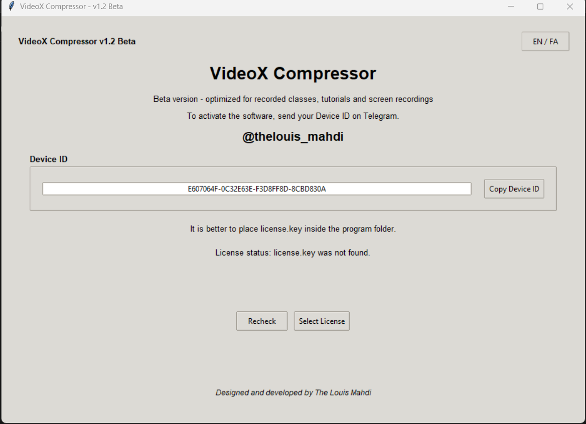
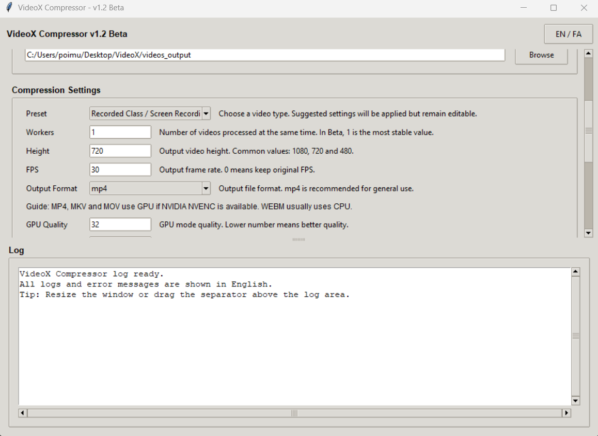
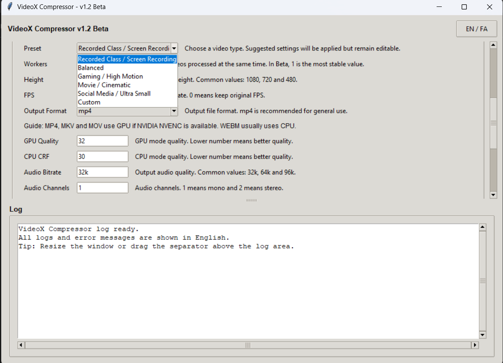
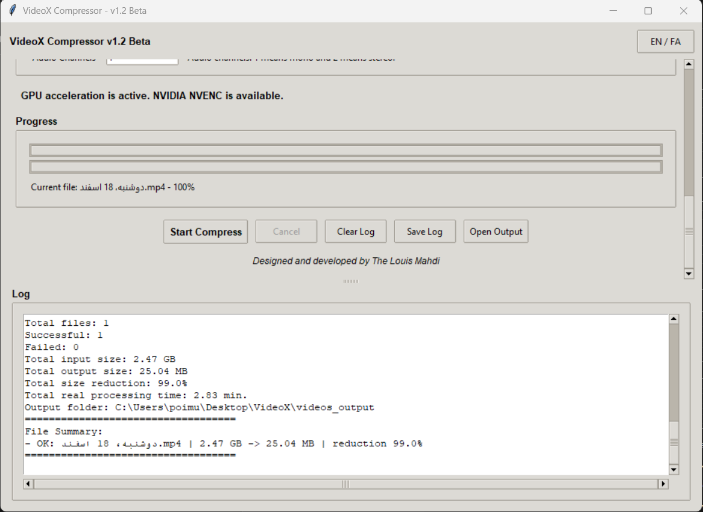
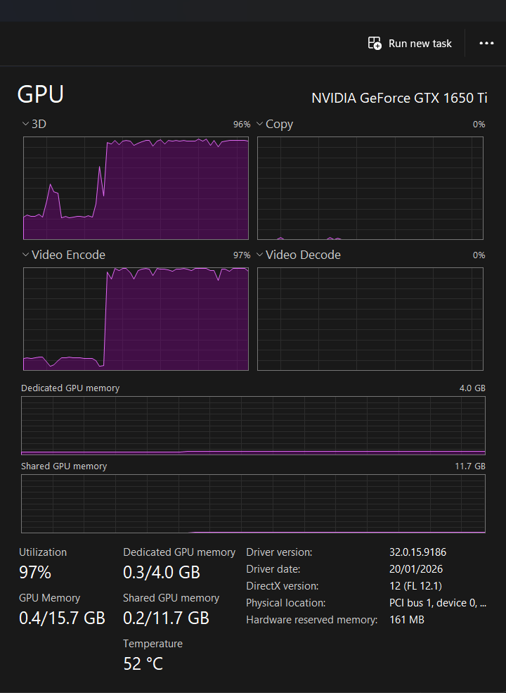
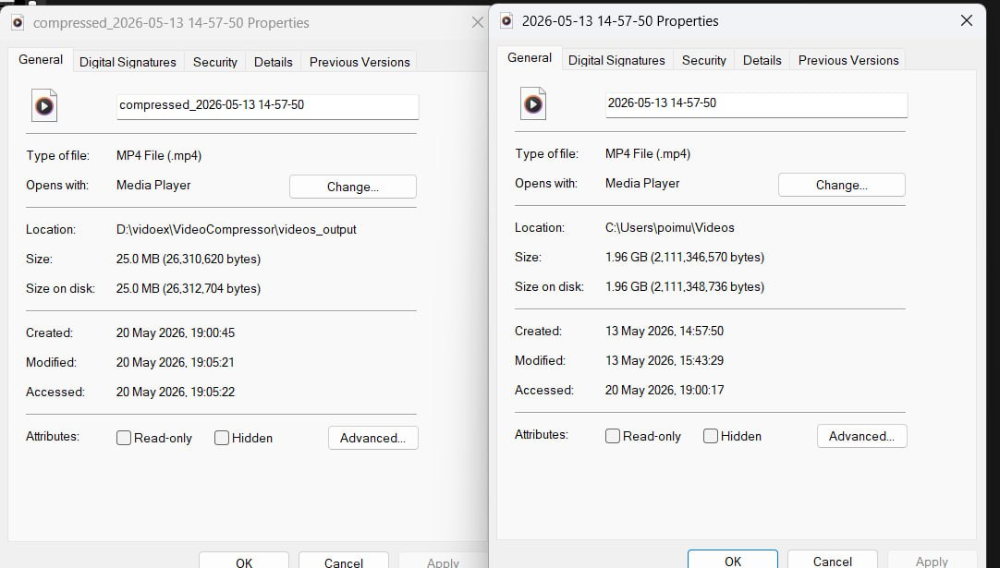

<div align="center">

# 🎬 VideoX Compressor

### Hardware-accelerated Windows video compression for recorded classes, tutorials, screen recordings and everyday videos.

<p>
  <a href="#english">English</a> •
  <a href="#quick-start-en">Quick Start</a> •
  <a href="#activation-en">Activation</a> •
  <a href="#simple-settings-en">Simple Settings</a> •
  <a href="#hardware-guide-en">Hardware Guide</a> •
  <a href="#parameter-guide-en">Parameters</a> •
  <a href="#persian">فارسی</a>
</p>


**Code, design and development by The Louis Mahdi**  
**Telegram:** `@thelouis_mahdi`

</div>

---

<a id="english"></a>

# 🇬🇧 English

## What is VideoX Compressor?

**VideoX Compressor** is a Windows video compression application designed to make heavy video files much smaller through a simple graphical interface.

The project focuses on **hardware-accelerated compression**. VideoX tries to use the best available video acceleration path on the system. Depending on the hardware and driver support, it can use **NVIDIA NVENC**, **Intel Quick Sync / QSV**, **AMD AMF**, or fall back to CPU mode.

The strongest current use case is **low-motion video**, including recorded classes, screen recordings, tutorials, online meetings, slide-based educational videos and university lecture recordings.

For this type of content, VideoX can produce a **dramatic file-size reduction** while keeping the output practical for watching, sharing and archiving.

> VideoX is currently a **Beta product**. Version `v1.2.5 Beta - General Safe Diagnostics` is the recommended public beta build for testing and limited distribution.

---

<a id="quick-start-en"></a>

## Quick Start for Normal Users

Most users do **not** need to understand every parameter. Start with this safe setup:

```text
Preset: Recorded Class / Screen Recording
Output Format: mp4
Performance Mode: Stable
Processing Strategy: Auto Balanced
General Safe Mode: On
Hardware Decode: Off
Workers: 1
```

Then click **Start Compress**.

This setup is recommended because it is stable on most systems and still allows VideoX to use hardware encoding when the system supports it.

---

<a id="activation-en"></a>

## License Activation Guide

VideoX uses a **Device ID based license system**.

### Steps

1. Run `VideoX.exe`.
2. Copy the Device ID from the activation page.
3. Send the Device ID on Telegram to:

```text
@thelouis_mahdi
```

4. After verification, you will receive a device-specific `license.key` file.
5. Put `license.key` next to `VideoX.exe`, or select it inside the app.
6. Click **Recheck**.
7. Enter the program.

### Important Notes

- Each `license.key` is generated for one specific device.
- A license generated for one device will not work on another device.
- Do not share your `license.key` publicly.
- If activation fails, use **Export Bug Report** or send a screenshot of the activation page.

---

## Why VideoX?

| Advantage | Explanation |
|---|---|
| Hardware acceleration | Tries to use NVIDIA, Intel or AMD video acceleration when available. |
| Fast processing | On supported systems, hardware encoding can be much faster than CPU-only compression. |
| Huge reduction on low-motion videos | Especially strong for classes, tutorials, meetings and screen recordings. |
| Simple workflow | Select videos, choose a preset, choose output folder and start compression. |
| Ready presets | Includes modes for classes, balanced use, gaming, movies and social media. |
| Editable settings | Presets apply recommended values, but users can still adjust parameters manually. |
| Safe public mode | General Safe Mode creates useful logs if something goes wrong. |
| Progress and final report | Shows progress, output size, reduction percentage and real processing time. |
| Device-based activation | License is connected to the user device by Device ID. |

---

## Small Comparison with Similar Tools

VideoX does not try to replace every professional encoder or video editor. Its goal is more focused: **fast and simple compression for recorded classes, tutorials, screen recordings and other low-motion videos**.

| Tool Type | Typical Experience | VideoX Position |
|---|---|---|
| General video converters | Useful for many formats, but often designed as broad conversion tools. | More focused on fast compression and very small outputs for educational and low-motion videos. |
| Professional encoders | Powerful and flexible, but may feel complex for normal users. | Simpler workflow with ready presets and fewer decisions for everyday compression. |
| CPU-based compression tools | Can produce good quality, but may take longer on large files. | Prioritizes hardware acceleration when supported hardware is available. |
| Full video editors | Great for editing and production, but heavy for simple compression tasks. | Lightweight workflow for users who only want to reduce file size quickly. |

---

## Important Changes in v1.2.5 Beta

| Area | Added / Improved |
|---|---|
| General Safe Mode | Recommended for public testing; saves useful logs if errors happen. |
| Export Bug Report | Creates a diagnostic report users can send for support. |
| Open Logs | Opens the folder where session logs and bug reports are stored. |
| GPU Diagnostics | Tests important encoders and saves a diagnostic report. |
| Hardware paths | Better selection between NVIDIA NVENC, Intel QSV, AMD AMF and CPU fallback. |
| Processing Strategy | Lets users choose Auto Balanced, Maximum Hardware Acceleration, Stable Mode or CPU Only. |
| Hardware Decode | Adds Off, Auto and Aggressive modes for decode-side acceleration testing. |
| Pipeline logging | Logs Decode Mode, Scale Mode, Encode Mode and the reason for selection. |
| Queue safety | Files and settings are locked while compression is running to prevent queue bugs. |
| Hidden FFmpeg window | FFmpeg and FFprobe run without visible CMD windows. |
| Progress tracking | Current-file progress bar, total progress bar and controlled progress logs. |
| Final report | English report with input size, output size, reduction percentage, success/fail count and output folder. |
| Save settings | Saves language, preset, output folder, window size and custom settings. |

---

## Screenshots

### License / Device ID Activation

<div align="center">



</div>

The activation page shows the user Device ID. The user sends this code on Telegram and receives a device-specific `license.key` file.

### Main Compression Interface

<div align="center">



</div>

The main interface includes video selection, output folder, ready presets, output format, compression parameters and the log area.

### Ready Presets

<div align="center">



</div>

Presets make the program easier for non-technical users. They apply recommended settings automatically, while still allowing manual changes.

### Progress and Final Report

<div align="center">



</div>

VideoX shows progress, real processing time, total input size, total output size and reduction percentage.

### GPU Acceleration in Action

<div align="center">



</div>

This demonstrates the accelerator-based design of the app. In Task Manager, video encoding usually appears under **Video Encode**, not necessarily under 3D or CUDA.

---

## Real Compression Example

<div align="center">



</div>

This test was performed on a recorded class video.

| Item | Size |
|---|---:|
| Original recorded class video | 1.96 GB |
| Compressed output | 25 MB |
| Approximate reduction | ~98.7% |

This type of result is most realistic for low-motion content such as recorded lectures, tutorials, screen recordings, online meetings and slide-based videos.

---

<a id="simple-settings-en"></a>

## Simple Settings Guide

### For recorded classes, screen recordings and online meetings

Recommended for most users:

```text
Preset: Recorded Class / Screen Recording
Output Format: mp4
Performance Mode: Stable
Processing Strategy: Auto Balanced
General Safe Mode: On
Hardware Decode: Off
Workers: 1
Height: 720 or 1080
FPS: 24
GPU Quality: 32
CPU CRF: 30
Audio Bitrate: 32k
Audio Channels: 1
```

### For general videos

```text
Preset: Balanced
Output Format: mp4
Performance Mode: Stable
Processing Strategy: Auto Balanced
General Safe Mode: On
Hardware Decode: Off
Workers: 1
Height: 1080
FPS: 0
GPU Quality: 30
CPU CRF: 28
Audio Bitrate: 64k
Audio Channels: 2
```

### For gaming and high-motion videos

```text
Preset: Gaming / High Motion
Output Format: mp4
Performance Mode: Stable
Processing Strategy: Auto Balanced
General Safe Mode: On
Hardware Decode: Off
Workers: 1
Height: 1080
FPS: 0 or 60
GPU Quality: 28
CPU CRF: 25
Audio Bitrate: 64k
Audio Channels: 2
```

### For maximum speed testing on strong systems

Use only if the safe settings already work correctly:

```text
Performance Mode: High Throughput
Processing Strategy: Maximum Hardware Acceleration
General Safe Mode: On
Hardware Decode: Aggressive
Workers: 1 or 2
Output Format: mp4
```

If errors happen, return to:

```text
Performance Mode: Stable
Processing Strategy: Auto Balanced
Hardware Decode: Off
```

---

<a id="hardware-guide-en"></a>

## Best Settings for Different Systems

### 1. Old laptop or weak CPU / no dedicated GPU

Use CPU-safe settings:

```text
Preset: Recorded Class / Screen Recording
Performance Mode: Stable
Processing Strategy: Auto Balanced or CPU Only
General Safe Mode: On
Hardware Decode: Off
Workers: 1
Height: 720
FPS: 24
Output Format: mp4
```

Expected behavior: VideoX may use CPU fallback. Processing can be slower, but this is the safest setup.

### 2. Intel laptop with integrated graphics

Many Intel CPUs include Quick Sync support, but this depends on driver and generation.

```text
Performance Mode: Stable
Processing Strategy: Auto Balanced
General Safe Mode: On
Hardware Decode: Off
Workers: 1
Output Format: mp4
```

If GPU Diagnostics shows QSV working, VideoX may use Intel hardware encoding.

### 3. NVIDIA GTX / RTX system

Recommended first test:

```text
Performance Mode: Stable
Processing Strategy: Auto Balanced
General Safe Mode: On
Hardware Decode: Off
Workers: 1
Output Format: mp4
```

Speed test after the safe mode works:

```text
Performance Mode: High Throughput
Processing Strategy: Maximum Hardware Acceleration
General Safe Mode: On
Hardware Decode: Aggressive
Workers: 1 or 2
```

Notes:

- If HEVC NVENC fails, VideoX may try H.264 NVENC.
- Video Encode usage in Task Manager is more important than 3D usage.
- Driver version can affect hardware acceleration.

### 4. AMD Radeon system

Use safe hardware detection first:

```text
Performance Mode: Stable
Processing Strategy: Auto Balanced
General Safe Mode: On
Hardware Decode: Off
Workers: 1
Output Format: mp4
```

If AMF works, VideoX may use AMD hardware encoding. If not, it falls back to CPU mode.

### 5. Powerful desktop workstation

Start stable, then test throughput:

```text
First test:
Performance Mode: Stable
Processing Strategy: Auto Balanced
General Safe Mode: On
Hardware Decode: Off
Workers: 1
```

```text
Speed test:
Performance Mode: High Throughput
Processing Strategy: Maximum Hardware Acceleration
General Safe Mode: On
Hardware Decode: Aggressive
Workers: 2
```

If the system becomes unstable or files fail, reduce Workers to 1 and turn Hardware Decode Off.

---

## Ready Presets

VideoX includes ready-made modes for different video types. Presets apply suggested values automatically, but the output format and parameters remain editable.

| Preset | Best for |
|---|---|
| Recorded Class / Screen Recording | Recorded classes, tutorials, meetings, slides and low-motion videos. |
| Balanced | General videos when you are not sure which mode to choose. |
| Gaming / High Motion | Gameplay, fast camera movement and motion-heavy videos. |
| Movie / Cinematic | Videos where detail preservation matters more than extreme compression. |
| Social Media / Ultra Small | When the smallest possible output size is the priority. |

---

<a id="parameter-guide-en"></a>

## Parameter Guide

| Parameter | Recommended / Allowed Values | Simple Explanation |
|---|---|---|
| Workers | 1 to 4 | Number of files processed at the same time. Use 1 for stability. Use 2 only for strong systems. |
| Height | 144 or higher | Output video height. Common values: 480, 720, 1080. |
| FPS | 0 or higher | `0` keeps original FPS. Use 24 for classes; 30 or 60 for high-motion videos. |
| Output Format | mp4, mkv, mov, webm, avi | MP4 is recommended for most users. |
| Performance Mode | Stable, High Throughput | Stable is safer. High Throughput may process more than one file with hardware acceleration. |
| Processing Strategy | Auto Balanced, Maximum Hardware Acceleration, Stable Mode, CPU Only | Auto Balanced is recommended. Maximum Hardware Acceleration is for speed testing. CPU Only disables hardware encoding. |
| General Safe Mode | On, Off | Keep On for public use. It saves diagnostic reports if errors happen. |
| Hardware Decode | Off, Auto, Aggressive | Off is safest. Auto tries hardware decoding. Aggressive tries more GPU-side processing on supported systems. |
| GPU Quality | 18 to 45 | Lower number = better quality and larger file. Higher number = smaller file and lower quality. |
| CPU CRF | 18 to 45 | Lower number = better quality and larger file. Higher number = smaller file and lower quality. |
| Audio Bitrate | 24k, 32k, 64k, 96k, etc. | Higher value gives better audio quality and larger size. |
| Audio Channels | 1 or 2 | `1` = mono, `2` = stereo. |

### Recommended values to avoid confusion

If you are not sure what to choose, use:

```text
Performance Mode: Stable
Processing Strategy: Auto Balanced
General Safe Mode: On
Hardware Decode: Off
Workers: 1
Output Format: mp4
```

---

## Diagnostic Logs and Bug Reports

Version `v1.2.5` adds support-oriented logs.

If an error happens, VideoX can save a diagnostic report containing:

- app version
- local and UTC timestamp
- Windows and system information
- FFmpeg and FFprobe paths
- available video encoders
- runtime encoder test results
- selected settings
- selected encoder
- current input file
- FFmpeg error output
- current UI log

Default log folder:

```text
C:\Users\<User>\AppData\Local\TheLouisMahdi\VideoXCompressor\logs
```

Use **Open Logs** to open this folder, or use **Export Bug Report** to create a report manually.

---

## Technical Overview

VideoX is built as a Windows GUI application around FFmpeg and FFprobe.

| Component | Role |
|---|---|
| FFmpeg | Main compression engine. |
| FFprobe | Reads video metadata such as FPS, resolution, codec and duration. |
| NVIDIA NVENC | NVIDIA hardware encoder used when available. |
| Intel QSV | Intel Quick Sync hardware path used when available. |
| AMD AMF | AMD hardware encoder path used when available. |
| CPU fallback | Used automatically when hardware acceleration is unavailable or unstable. |
| H.265 / HEVC | Main compression codec for strong size reduction in MP4/MKV/MOV outputs. |
| VP9 / Opus | Used for WEBM output. |

### GPU / CPU behavior

| Output Format | Expected Processing Mode |
|---|---|
| MP4 | Hardware acceleration if available, otherwise CPU |
| MKV | Hardware acceleration if available, otherwise CPU |
| MOV | Hardware acceleration if available, otherwise CPU |
| WEBM | Usually CPU mode |
| AVI | Depends on available encoder |

For general use, **MP4** is recommended.

---

## Download & Installation

Go to the **Releases** section and download the latest ZIP package.

```text
VideoX_Compressor_v1.2.5_Beta_General_Safe_Diagnostics.zip
```

Extract the ZIP file and run:

```text
VideoX.exe
```

Do not delete these folders:

```text
ffmpeg/
_internal/
```

The FFmpeg folder should contain:

```text
ffmpeg/bin/ffmpeg.exe
ffmpeg/bin/ffprobe.exe
```

---

## Beta Status

VideoX Compressor is currently in **Beta**. It is not yet a fully polished commercial product, but it is actively moving in that direction.

Current focus:

- best results on recorded classes and low-motion educational videos
- better hardware compatibility
- safer public testing
- better diagnostic reports
- better high-motion presets
- improved UI and user experience
- more accurate time estimation
- continuous feedback from testers and real users

---

<a id="persian"></a>

<div dir="rtl" align="right">

# 🇮🇷 فارسی

## معرفی برنامه

**ویدیو ایکس کامپرسور** یک نرم‌افزار ویندوزی برای فشرده‌سازی ویدیو است. هدف برنامه این است که کاربر بدون نوشتن دستورهای پیچیده، بتواند فایل‌های ویدیویی سنگین را به خروجی کم‌حجم‌تر تبدیل کند.

تمرکز اصلی برنامه روی فشرده‌سازی شتاب‌داده‌شده با سخت‌افزار است. برنامه تلاش می‌کند بهترین مسیر پردازش موجود روی همان سیستم را انتخاب کند. بسته به سخت‌افزار و درایور، ممکن است از مسیرهای انویدیا، اینتل، ای‌ام‌دی یا حالت پردازنده استفاده شود.

بهترین کاربرد فعلی برنامه برای ویدیوهای کم‌تحرک است؛ مثل کلاس ضبط‌شده، آموزش، جلسه آنلاین، اسکرین‌ریکورد و ویدیوهای پاورپوینتی. در این نوع ویدیوها، برنامه می‌تواند کاهش حجم بسیار چشمگیر ایجاد کند و خروجی همچنان برای مشاهده، ارسال و آرشیو مناسب باقی بماند.

> نسخه `v1.2.5 Beta - General Safe Diagnostics` نسخه پیشنهادی برای انتشار عمومی آزمایشی و تست محدود است.

---

## شروع سریع برای کاربر عادی

لازم نیست همه پارامترها را بلد باشید. برای شروع از این تنظیمات استفاده کنید:

```text
Preset: Recorded Class / Screen Recording
Output Format: mp4
Performance Mode: Stable
Processing Strategy: Auto Balanced
General Safe Mode: On
Hardware Decode: Off
Workers: 1
```

بعد روی دکمه شروع فشرده‌سازی بزنید.

این تنظیمات برای بیشتر سیستم‌ها امن‌تر است و اگر شتاب‌دهنده سخت‌افزاری قابل استفاده باشد، برنامه خودش تلاش می‌کند از آن استفاده کند.

---

## آموزش فعال‌سازی

برنامه از سیستم لایسنس بر اساس کد دستگاه استفاده می‌کند.

### مراحل

1. فایل `VideoX.exe` را اجرا کنید.
2. در صفحه فعال‌سازی، کد دستگاه را کپی کنید.
3. کد دستگاه را در تلگرام به آیدی زیر ارسال کنید.

```text
@thelouis_mahdi
```

4. بعد از بررسی، فایل مخصوص همان دستگاه را دریافت می‌کنید.
5. فایل لایسنس را کنار فایل اجرایی برنامه قرار دهید یا از داخل برنامه انتخاب کنید.
6. روی دکمه بررسی دوباره بزنید.
7. وارد برنامه شوید.

### نکات مهم

- هر فایل لایسنس فقط برای یک دستگاه ساخته می‌شود.
- لایسنس یک دستگاه روی دستگاه دیگر فعال نمی‌شود.
- فایل لایسنس خود را عمومی منتشر نکنید.
- اگر فعال‌سازی مشکل داشت، از صفحه فعال‌سازی عکس بفرستید یا گزینه ساخت گزارش خطا را بزنید.

---

## چرا این برنامه؟

| مزیت | توضیح |
|---|---|
| شتاب‌دهی سخت‌افزاری | در صورت وجود سخت‌افزار مناسب، پردازش ویدیو با مسیر گرافیکی انجام می‌شود. |
| سرعت بالا | روی سیستم‌های سازگار، پردازش می‌تواند بسیار سریع‌تر از حالت پردازنده‌محور باشد. |
| کاهش حجم چشمگیر | برای کلاس، آموزش، جلسه و اسکرین‌ریکورد بسیار مناسب است. |
| کاربری ساده | کاربر ویدیو را انتخاب می‌کند، حالت آماده را می‌زند، مسیر خروجی را انتخاب می‌کند و فشرده‌سازی را شروع می‌کند. |
| حالت‌های آماده | برای کلاس، حالت متعادل، گیمینگ، فیلم و شبکه اجتماعی تنظیمات آماده وجود دارد. |
| حالت امن عمومی | اگر خطا رخ دهد، گزارش عیب‌یابی ذخیره می‌شود. |
| گزارش نهایی | حجم قبل و بعد، درصد کاهش حجم، زمان واقعی پردازش و وضعیت فایل‌ها نمایش داده می‌شود. |
| فعال‌سازی دستگاهی | لایسنس بر اساس کد دستگاه فعال می‌شود. |

---

## مقایسه کوتاه با ابزارهای مشابه

این برنامه قرار نیست جایگزین همه ابزارهای حرفه‌ای ویرایش یا کدگذاری ویدیو باشد. تمرکز اصلی آن روی یک نیاز مشخص است: فشرده‌سازی سریع و ساده برای کلاس‌های ضبط‌شده، آموزش‌ها، اسکرین‌ریکوردها و ویدیوهای کم‌تحرک.

| نوع ابزار | تجربه معمول | جایگاه این برنامه |
|---|---|---|
| مبدل‌های عمومی ویدیو | برای فرمت‌های زیاد کاربرد دارند، اما معمولاً عمومی و گسترده طراحی شده‌اند. | تمرکز بیشتری روی کاهش حجم سریع برای ویدیوهای آموزشی و کم‌تحرک دارد. |
| ابزارهای حرفه‌ای کدگذاری | قدرت و انعطاف زیادی دارند، اما برای کاربر عادی ممکن است پیچیده باشند. | مسیر ساده‌تری ارائه می‌دهد و تنظیمات آماده دارد. |
| ابزارهای پردازنده‌محور | کیفیت خوبی می‌دهند، اما روی فایل‌های بزرگ ممکن است زمان‌بر باشند. | در صورت وجود سخت‌افزار مناسب، اولویت را روی شتاب‌دهی سخت‌افزاری می‌گذارد. |
| نرم‌افزارهای کامل تدوین | برای تولید و ویرایش حرفه‌ای عالی هستند، اما برای فشرده‌سازی ساده سنگین‌اند. | برای کاربری سبک‌تر و سریع‌تر طراحی شده است. |

---

## تغییرات مهم نسخه جدید

| بخش | تغییرات اضافه‌شده یا بهبودیافته |
|---|---|
| حالت امن عمومی | برای تست عمومی مناسب‌تر است و اگر خطا رخ دهد، گزارش عیب‌یابی ذخیره می‌کند. |
| ساخت گزارش خطا | کاربر می‌تواند گزارش کامل برای ارسال و بررسی بسازد. |
| باز کردن لاگ‌ها | کاربر می‌تواند پوشه لاگ‌ها را مستقیم از داخل برنامه باز کند. |
| عیب‌یابی گرافیکی | تست شتاب‌دهنده‌ها انجام می‌شود و گزارش ذخیره می‌شود. |
| مسیرهای سخت‌افزاری | انتخاب بین مسیرهای انویدیا، اینتل، ای‌ام‌دی و پردازنده بهتر شده است. |
| استراتژی پردازش | حالت‌های Auto Balanced، Maximum Hardware Acceleration، Stable Mode و CPU Only اضافه شده‌اند. |
| دیکد سخت‌افزاری | حالت‌های Off، Auto و Aggressive اضافه شده‌اند. |
| لاگ مسیر پردازش | Decode Mode، Scale Mode، Encode Mode و علت انتخاب مسیر نوشته می‌شود. |
| امنیت صف پردازش | هنگام فشرده‌سازی، فایل‌ها و تنظیمات قفل می‌شوند تا صف پردازش خراب نشود. |
| حذف پنجره مزاحم | ابزارهای پردازش ویدیو دیگر پنجره جداگانه و مزاحم باز نمی‌کنند. |
| نمایش پیشرفت | نوار پیشرفت برای فایل جاری، کل عملیات و گزارش کنترل‌شده پیشرفت اضافه شده است. |

---

## اسکرین‌شات‌ها

### صفحه فعال‌سازی و کد دستگاه

<div align="center">


</div>

در این صفحه، کد دستگاه نمایش داده می‌شود و کاربر می‌تواند آن را برای دریافت لایسنس ارسال کند.

### صفحه اصلی تنظیمات

<div align="center">


</div>

در صفحه اصلی، کاربر می‌تواند ویدیوها، مسیر خروجی، حالت آماده، فرمت خروجی و پارامترهای فشرده‌سازی را انتخاب کند.

### صفحه پیشرفت و گزارش نهایی

<div align="center">


</div>

در این بخش، پیشرفت پردازش، زمان واقعی، حجم خروجی و درصد کاهش حجم نمایش داده می‌شود.

---

## نمونه واقعی فشرده‌سازی کلاس

<div align="center">


</div>

```text
Original file size: 1.96 GB
Compressed file size: 25 MB
Approximate reduction: 98.7%
```

این نتیجه بیشتر برای ویدیوهای کم‌تحرک مثل کلاس، آموزش، جلسه، اسکرین‌ریکورد و ویدیوهای پاورپوینتی قابل دستیابی است.

---

## راهنمای ساده تنظیمات

### برای کلاس، اسکرین‌ریکورد و جلسه آنلاین

```text
Preset: Recorded Class / Screen Recording
Output Format: mp4
Performance Mode: Stable
Processing Strategy: Auto Balanced
General Safe Mode: On
Hardware Decode: Off
Workers: 1
Height: 720 or 1080
FPS: 24
GPU Quality: 32
CPU CRF: 30
Audio Bitrate: 32k
Audio Channels: 1
```

### برای ویدیوهای عمومی

```text
Preset: Balanced
Output Format: mp4
Performance Mode: Stable
Processing Strategy: Auto Balanced
General Safe Mode: On
Hardware Decode: Off
Workers: 1
Height: 1080
FPS: 0
GPU Quality: 30
CPU CRF: 28
Audio Bitrate: 64k
Audio Channels: 2
```

### برای گیمینگ و ویدیوهای پرتحرک

```text
Preset: Gaming / High Motion
Output Format: mp4
Performance Mode: Stable
Processing Strategy: Auto Balanced
General Safe Mode: On
Hardware Decode: Off
Workers: 1
Height: 1080
FPS: 0 or 60
GPU Quality: 28
CPU CRF: 25
Audio Bitrate: 64k
Audio Channels: 2
```

### برای تست سرعت روی سیستم‌های قوی

فقط وقتی تنظیمات امن درست کار کرد از این حالت استفاده کنید:

```text
Performance Mode: High Throughput
Processing Strategy: Maximum Hardware Acceleration
General Safe Mode: On
Hardware Decode: Aggressive
Workers: 1 or 2
Output Format: mp4
```

اگر خطا رخ داد، به این حالت برگردید:

```text
Performance Mode: Stable
Processing Strategy: Auto Balanced
Hardware Decode: Off
```

---

## بهترین تنظیمات برای سیستم‌های مختلف

### ۱. لپتاپ قدیمی یا سیستم بدون کارت گرافیک مجزا

```text
Preset: Recorded Class / Screen Recording
Performance Mode: Stable
Processing Strategy: Auto Balanced or CPU Only
General Safe Mode: On
Hardware Decode: Off
Workers: 1
Height: 720
FPS: 24
Output Format: mp4
```

در این حالت ممکن است برنامه با پردازنده کار کند. سرعت کمتر است، اما پایداری بیشتر است.

### ۲. لپتاپ دارای گرافیک داخلی اینتل

```text
Performance Mode: Stable
Processing Strategy: Auto Balanced
General Safe Mode: On
Hardware Decode: Off
Workers: 1
Output Format: mp4
```

اگر عیب‌یابی گرافیکی نشان دهد مسیر اینتل فعال است، برنامه ممکن است از شتاب‌دهنده اینتل استفاده کند.

### ۳. سیستم دارای کارت گرافیک انویدیا

تست اول:

```text
Performance Mode: Stable
Processing Strategy: Auto Balanced
General Safe Mode: On
Hardware Decode: Off
Workers: 1
Output Format: mp4
```

تست سرعت بعد از موفق بودن حالت امن:

```text
Performance Mode: High Throughput
Processing Strategy: Maximum Hardware Acceleration
General Safe Mode: On
Hardware Decode: Aggressive
Workers: 1 or 2
```

نکته: در ویندوز، مصرف شتاب‌دهنده ویدیو معمولاً در بخش Video Encode دیده می‌شود، نه لزوماً بخش 3D.

### ۴. سیستم دارای کارت گرافیک ای‌ام‌دی

```text
Performance Mode: Stable
Processing Strategy: Auto Balanced
General Safe Mode: On
Hardware Decode: Off
Workers: 1
Output Format: mp4
```

اگر مسیر سخت‌افزاری ای‌ام‌دی فعال باشد، برنامه از آن استفاده می‌کند. در غیر این صورت به حالت پردازنده برمی‌گردد.

### ۵. سیستم دسکتاپ قوی

ابتدا پایدار تست کنید:

```text
Performance Mode: Stable
Processing Strategy: Auto Balanced
General Safe Mode: On
Hardware Decode: Off
Workers: 1
```

سپس تست سرعت:

```text
Performance Mode: High Throughput
Processing Strategy: Maximum Hardware Acceleration
General Safe Mode: On
Hardware Decode: Aggressive
Workers: 2
```

اگر خطا رخ داد، تعداد پردازش همزمان را روی ۱ بگذارید و Hardware Decode را خاموش کنید.

---

## راهنمای پارامترها

| پارامتر | مقدار مجاز یا پیشنهادی | توضیح ساده |
|---|---|---|
| تعداد پردازش همزمان | ۱ تا ۴ | تعداد فایل‌هایی که همزمان پردازش می‌شوند. برای پایداری، مقدار ۱ بهتر است. |
| ارتفاع خروجی | ۱۴۴ به بالا | مقدارهای رایج شامل ۴۸۰، ۷۲۰ و ۱۰۸۰ هستند. |
| نرخ فریم | ۰ به بالا | مقدار ۰ یعنی حفظ نرخ فریم اصلی. برای کلاس مقدار ۲۴ و برای ویدیوهای پرتحرک مقدار ۳۰ یا ۶۰ بهتر است. |
| فرمت خروجی | `mp4`, `mkv`, `mov`, `webm`, `avi` | برای استفاده عمومی، `mp4` پیشنهاد می‌شود. |
| حالت عملکرد | Stable یا High Throughput | حالت Stable پایدارتر است. حالت High Throughput برای تست سرعت روی سیستم‌های قوی‌تر است. |
| استراتژی پردازش | Auto Balanced، Maximum Hardware Acceleration، Stable Mode، CPU Only | حالت Auto Balanced برای بیشتر کاربران پیشنهاد می‌شود. |
| حالت امن عمومی | On یا Off | برای انتشار عمومی و گزارش خطا بهتر است روشن باشد. |
| دیکد سخت‌افزاری | Off، Auto، Aggressive | حالت Off پایدارتر است. حالت Aggressive فقط برای تست سرعت روی سیستم‌های سازگار است. |
| کیفیت گرافیکی | ۱۸ تا ۴۵ | عدد کمتر یعنی کیفیت بهتر و حجم بیشتر. عدد بالاتر یعنی حجم کمتر و کیفیت پایین‌تر. |
| کیفیت پردازنده | ۱۸ تا ۴۵ | عدد کمتر یعنی کیفیت بهتر و حجم بیشتر. عدد بالاتر یعنی حجم کمتر و کیفیت پایین‌تر. |
| کیفیت صدا | مثل `24k`, `32k`, `64k`, `96k` | عدد بیشتر یعنی کیفیت صدای بهتر و حجم بیشتر. |
| کانال صدا | ۱ یا ۲ | مقدار ۱ یعنی مونو و مقدار ۲ یعنی استریو. |

اگر نمی‌دانید چه چیزی انتخاب کنید، از این‌ها استفاده کنید:

```text
Performance Mode: Stable
Processing Strategy: Auto Balanced
General Safe Mode: On
Hardware Decode: Off
Workers: 1
Output Format: mp4
```

---

## لاگ‌ها و گزارش خطا

در نسخه `v1.2.5` اگر خطا رخ دهد، برنامه می‌تواند گزارش عیب‌یابی بسازد.

گزارش شامل این موارد است:

- نسخه برنامه
- تاریخ و ساعت
- اطلاعات ویندوز و سیستم
- مسیر ابزارهای پردازش ویدیو
- شتاب‌دهنده‌های موجود
- نتیجه تست شتاب‌دهنده‌ها
- تنظیمات انتخاب‌شده
- شتاب‌دهنده انتخاب‌شده
- فایل ورودی فعلی
- خطای پردازش
- لاگ فعلی برنامه

محل پیش‌فرض لاگ‌ها:

```text
C:\Users\<User>\AppData\Local\TheLouisMahdi\VideoXCompressor\logs
```

از دکمه Open Logs برای باز کردن پوشه لاگ‌ها و از دکمه Export Bug Report برای ساخت گزارش دستی استفاده کنید.

---

## توضیح فنی

این برنامه یک رابط گرافیکی ویندوزی برای فشرده‌سازی ویدیو است و از موتور پردازش ویدیویی شناخته‌شده استفاده می‌کند. برنامه اطلاعات ویدیو را می‌خواند، مسیر مناسب را انتخاب می‌کند و سپس فایل خروجی را با تنظیمات انتخاب‌شده می‌سازد.

| بخش | نقش |
|---|---|
| موتور فشرده‌سازی | اجرای پردازش اصلی ویدیو و تولید فایل خروجی. |
| ابزار خواندن اطلاعات ویدیو | خواندن نرخ فریم، رزولوشن، کدک و مدت ویدیو. |
| مسیر انویدیا | استفاده از شتاب‌دهنده ویدیویی انویدیا در صورت امکان. |
| مسیر اینتل | استفاده از شتاب‌دهنده ویدیویی اینتل در صورت امکان. |
| مسیر ای‌ام‌دی | استفاده از شتاب‌دهنده ویدیویی ای‌ام‌دی در صورت امکان. |
| حالت پردازنده | استفاده خودکار وقتی شتاب‌دهنده سخت‌افزاری در دسترس نیست. |

برای استفاده عمومی، فرمت `mp4` پیشنهاد می‌شود.

---

## نصب و اجرا

از بخش انتشارها، آخرین فایل فشرده برنامه را دانلود کنید.

```text
VideoX_Compressor_v1.2.5_Beta_General_Safe_Diagnostics.zip
```

فایل را از حالت فشرده خارج کنید و این فایل را اجرا کنید:

```text
VideoX.exe
```

این پوشه‌ها را حذف نکنید:

```text
ffmpeg/
_internal/
```

پوشه موتور پردازش باید شامل این فایل‌ها باشد:

```text
ffmpeg/bin/ffmpeg.exe
ffmpeg/bin/ffprobe.exe
```

---

## وضعیت بتا

برنامه در حال حاضر در وضعیت بتا قرار دارد. هنوز یک محصول تجاری کاملاً نهایی‌شده نیست، اما به‌صورت فعال در همین مسیر توسعه پیدا می‌کند.

تمرکز فعلی توسعه:

- بهترین نتیجه روی کلاس‌های ضبط‌شده و ویدیوهای کم‌تحرک
- سازگاری بهتر با سخت‌افزارهای مختلف
- تست عمومی امن‌تر
- گزارش خطای بهتر
- حالت‌های آماده بهتر برای ویدیوهای پرتحرک
- بهبود رابط کاربری و تجربه کاربر
- دقیق‌تر شدن تخمین زمان
- دریافت بازخورد مداوم از تسترها و کاربران واقعی

به‌عنوان توسعه‌دهنده، من به‌صورت مستقیم با تسترها و کاربران در ارتباط هستم تا بازخوردها، باگ‌ها و پیشنهادها را جمع‌آوری کنم و برنامه را مرحله‌به‌مرحله بهتر کنم.

</div>

---

<div align="center">

### Code, design and development by **The Louis Mahdi**

**Telegram:** `@thelouis_mahdi`

</div>
